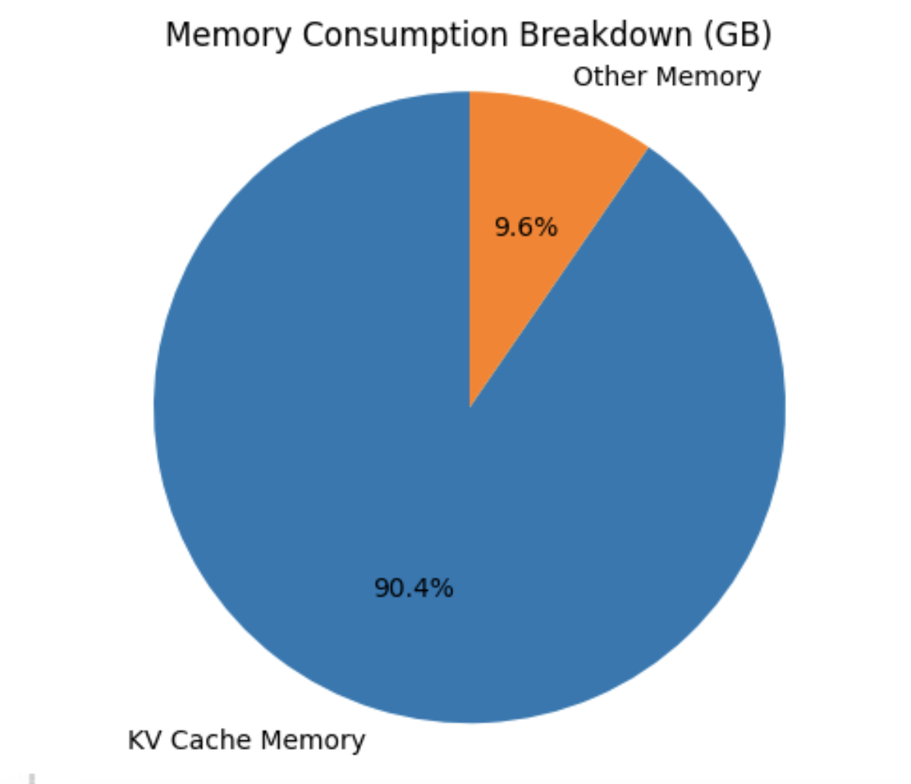
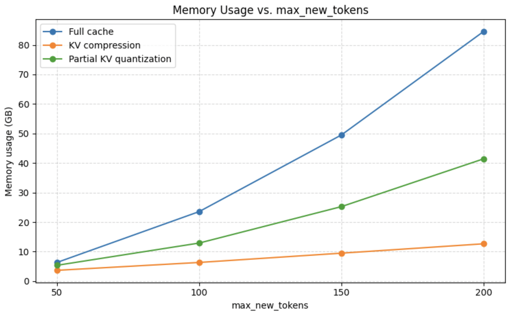

# Don’t Drop It, Compress It: Selective KV Quantization
---

## 🚀 Overview

Modern large language models (LLMs) rely on a **Key–Value (KV) cache** to store intermediate representations for long‐context generation, but this cache can consume **90%+ of GPU memory** as sequence length grows. Existing solutions either **drop** old tokens (sliding window, attention sinks) or **uniformly compress** all tokens, often trading off accuracy for memory.

**Selective KV Quantization** bridges this gap by:

1. **Preserving** “sink” (initial prompt) and a sliding “window” of recent tokens in full precision (FP16),  
2. **Aggressively quantizing** older tokens to int8, and  
3. **Dequantizing on‐the‐fly** only when needed for attention.


This hybrid strategy delivers up to **2× memory savings** with **no increase in perplexity** (5.56) and only a **minor drop in ROUGE-L** (0.2073 → 0.1709).

---

## 📊 Results

### Figure 1. Memory Breakdown  
  
> **KV cache accounts for over 90% of total GPU memory**, making it the primary target for optimization.

### Figure 2. Memory vs. Sequence Length  
  
> **Selective quantization** (green) and **compressed cache** (orange) both flatten memory growth compared to **full cache** (blue), achieving ~2× and ~4× reductions respectively at 200 tokens.

### Figure 3. Perplexity & ROUGE-L  
| Caching Strategy | Perplexity| ROUGE-L| Tokens/sec |
| ----------------:|:---------:| ------:| ----------:|
|     Full Cache   |    5.56   | 0.2073 |    6.75    |
| Compressed Cache |   132.08  | 0.1030 |    5.53    |
|  Quantized Cache |    5.56   | 0.1709 |    4.47    |

> - **Compressed cache** spikes perplexity (132.08) and drops ROUGE-L (0.1030).  
> - **Selective quantization** matches full cache perplexity (5.56) and only slightly lowers ROUGE-L to 0.1709.

#### Key Takeaways

- **Memory**: ~2× reduction with quantization vs. ~4× with aggressive compression  
- **Accuracy**: Quantization retains full-cache perplexity and minimal ROUGE-L drop  
- **Throughput**: Quantized setting runs at 4.47 tokens/s vs. 6.75 tokens/s (dequant overhead; custom CUDA kernels can close this gap)

---

## 📥 Installation

```bash
Make sure you’re on a machine with CUDA and PyTorch installed (A100 GPU recommended).

# Load environment (if on a cluster or Slurm setup)
module load anaconda
conda activate your_env_name

# Clone and enter the repo
git clone https://github.com/your-org/kv-quantization.git
cd kv-quantization

# Install dependencies
pip install -r requirements.txt
```

---

## ▶️ Usage

### 🔹 Full Precision (Baseline)

```bash
# Full-precision cache (no compression/quantization)
python generate.py --checkpoint_path checkpoints/llama3-8b/model.pth --prompt "Once upon a time,..." --max_new_tokens 200 --device cuda
```

### 🔸 Compressed Cache (Sink + Sliding Window)

```bash
#Compressed Cache
python generate.py --checkpoint_path checkpoints/llama3-8b/model.pth --prompt "Once upon a time,..." compress_kv --sink_size 16 --window_size 32 --max_new_tokens 200 --device cuda
```

### 🟢 Selective Quantization (Ours)

```bash
#Quantized Cache
python generate.py --checkpoint_path checkpoints/llama3-8b/model.pth --prompt "Once upon a time,..." quantize_kv --sink_size 16 --window_size 32 --max_new_tokens 200 --device cuda
```

### 📊 With PyTorch Profiler

```bash
#Enable detailed Pytorch profiling
python generate.py --checkpoint_path checkpoints/llama3-8b/model.pth --prompt "Once upon a time,..." quantize_kv --sink_size 16 --window_size 32 --max_new_tokens 200 --device cuda --profile run
```

You can modify the --sink_size and --window_size parameters to experiment with different memory-accuracy tradeoffs. Profiling results (memory, FLOPs, CUDA kernels) will be saved in the outputs/ folder.

